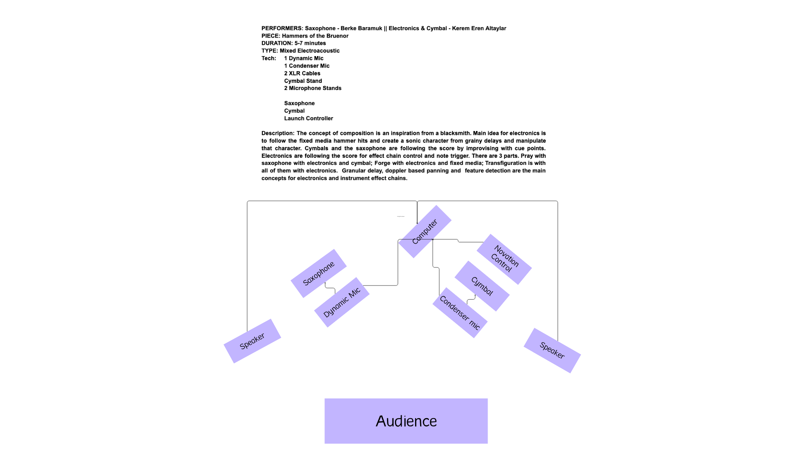

The concept of the composition is an inspiration from a blacksmith. The main idea
for the electronics is to follow the fixed media hammer hits, create a sonic
character from grainy delays, and manipulate that character. Cymbal and saxophone
follow the score by improvising with cue points.

There are three parts. **Pray** is saxophone with electronics and cymbal; **Forge**
is electronics and fixed media; **Transfiguration** is all of them with electronics.
Granular delay, doppler-based panning and feature detection are the main concepts
behind the electronics and the instrument effect chains.

## The story

> In the heart of the fiery forges of Mithral Hall, where the hammer's song
> resonated with the very heartbeat of the mountains, Bruenor Battlehammer, the
> stout and resolute King, stood with purpose. Guided by the ancestral wisdom of his
> people and the fervent desire to bestow upon his adopted son, Wulfgar, a weapon of
> legendary might, Bruenor began the sacred undertaking.
>
> For countless days and nights, the skilled dwarven smiths toiled under Bruenor's
> watchful eye, their hammers striking a rhythm that echoed through the deep caverns.
> In the fires of creation, the essence of Mithral Hall itself infused the metal of
> the mighty warhammer. With each stroke, runes of power were etched into its
> surface, binding the weapon to the very soul of the dwarven kingdom.
>
> Aegis-fang emerged from the flames, a testament to the enduring strength of dwarven
> kinship and the indomitable spirit of those who called the mountains their home. As
> the hammer cooled, Bruenor knew that this enchanted relic would not only cleave
> through foes on the battlefield but also forge a legacy that would resonate through
> the ages, a symbol of unity and resilience against the encroaching shadows of the
> realms.

## Setup

One dynamic mic on the saxophone, one condenser on the cymbal, both into the
computer and a Novation Launch Controller, diffused across a pair of speakers
flanking the audience.

## Notes

Presented at Sonified II, Istanbul, 2024.
